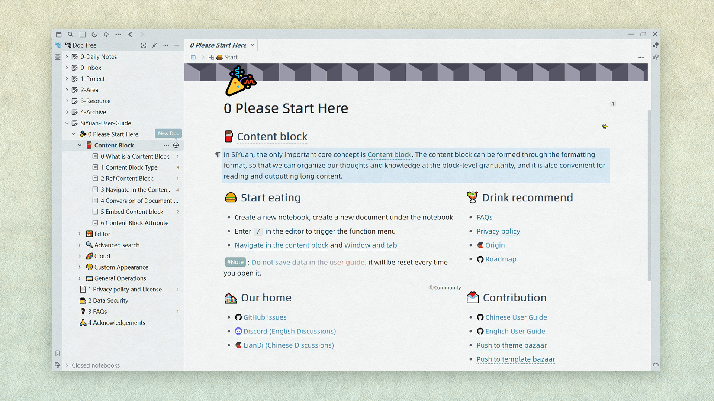

<h1 align="center">🧇Tsundoku(Texture): A Theme for SiYuan Note</h1>

          
           
           
           
           
          

English |<a href="https://www.yuque.com/achuan-2/siyuan/fqew9h"> 中文介绍</a>

[SiYuan](https://github.com/siyuan-note/siyuan) is a local-first personal knowledge management system, supports fine-grained block-level reference, and Markdown WYSIWYG. This is a theme for it.  

> 🎠 This may not be the most aesthetically pleasing theme for you, but perhaps it will be one of the most sought-after themes for the ultimate experience！
> 
> Others Themes: 🌞[Tsundoku Light](https://github.com/Achuan-2/siyuan-themes-tsundoku-light) | 🌙 [Tsundoku Dark ](https://github.com/Achuan-2/siyuan-themes-tsundoku) | 🥗[Tsundoku Green](https://github.com/Achuan-2/siyuan-themes-tsundoku-green)

## 💌 Origin

Tsundoku “積 ん 読” , a Japanese word，explained in Wikipedia as “Tsundoku is acquiring reading materials but letting them pile up in one's home without reading them. It is also used to refer to books ready for reading later when they are on a bookshelf.”

> Any PKM approach that doesn’t tie into execution tools is destined to languish on the back burner forever

I use this name to wake myself up and hope that SiYuan will help me make gradual progress and  get things done better, instead of becoming another dustbin for relieving intellectual anxiety and satisfying my digital hoarding disorder.

## ✨Features

This theme is based on the original theme [Tsundoku Light](https://github.com/Achuan-2/siyuan-themes-tsundoku-light) , adding a paper texture effect 
## ☎️Feedback

If there is a problem with the style of the theme, welcome to raise an issue in this repo or contact me via email (achuan-2@outlook.com). Before raising an issue, it is recommended to switch to the default theme to make sure it is a problem specific to this theme.

## 🚀Change Log

See [CHANGE_LOGS](CHANGE_LOGS.md)